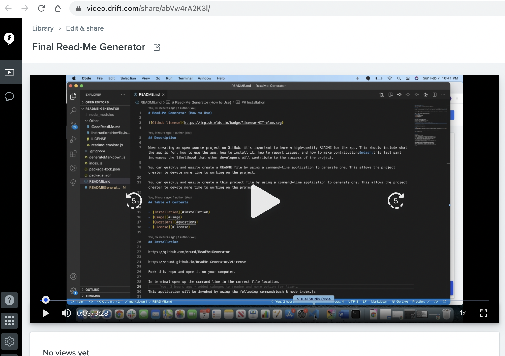

# Read-Me Generator (How to Use)

## Description

When creating an open source project on GitHub, it’s important to have a high-quality README for the app. This should include what the app is for, how to use the app, how to install it, how to report issues, and how to make contributions&mdash;this last part increases the likelihood that other developers will contribute to the success of the project.

You can quickly and easily create a README file by using a command-line application to generate one. This allows the project creator to devote more time to working on the project.

## Table of Contents

- [Installation](#installation)
- [Usage](#usage)
- [Questions](#questions)
- [License](#license)

## Installation

https://github.com/erumd/ReadMe-Generator

https://erumd.github.io/ReadMe-Generator/#License

Fork this repo and open it on your computer.

In terminal open up the command line in the correct file location.

This application will be invoked by using the following command:bash & node index.js

When prompted enter your response.

Open READMEGenerator to view your file.

## Usage

Use this link to watch a video on how to use this app to automatically generate a READMEGenerator.md file.
[https://video.drift.com/v/abVw4rA2K3l/].

## Questions

If you have any questions or would like to contribute you can view my GitHub account:
(https://github.com/erumd)
or email me erumdhukka531@gmail.com

## License

MIT License

Copyright (C) 2021, Erum Dhukka

Permission is hereby granted, free of charge, to any person obtaining a copy
of this software and associated documentation files (the "Software"), to deal
in the Software without restriction, including without limitation the rights
to use, copy, modify, merge, publish, distribute, sublicense, and/or sell
copies of the Software, and to permit persons to whom the Software is
furnished to do so, subject to the following conditions:

The above copyright notice and this permission notice shall be included in all
copies or substantial portions of the Software.

THE SOFTWARE IS PROVIDED "AS IS", WITHOUT WARRANTY OF ANY KIND, EXPRESS OR
IMPLIED, INCLUDING BUT NOT LIMITED TO THE WARRANTIES OF MERCHANTABILITY,
FITNESS FOR A PARTICULAR PURPOSE AND NONINFRINGEMENT. IN NO EVENT SHALL THE
AUTHORS OR COPYRIGHT HOLDERS BE LIABLE FOR ANY CLAIM, DAMAGES OR OTHER
LIABILITY, WHETHER IN AN ACTION OF CONTRACT, TORT OR OTHERWISE, ARISING FROM,
OUT OF OR IN CONNECTION WITH THE SOFTWARE OR THE USE OR OTHER DEALINGS IN THE
SOFTWARE.
